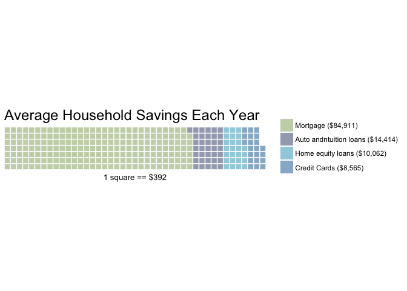
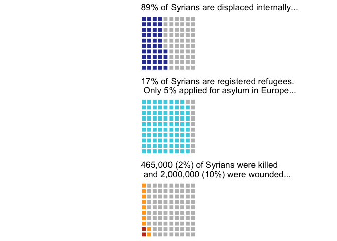
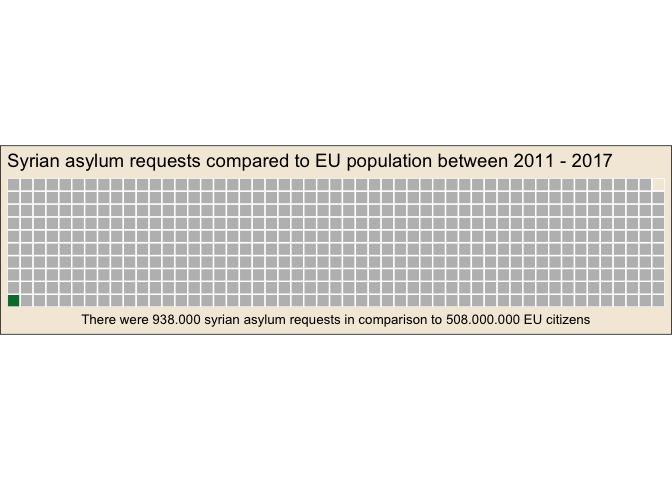
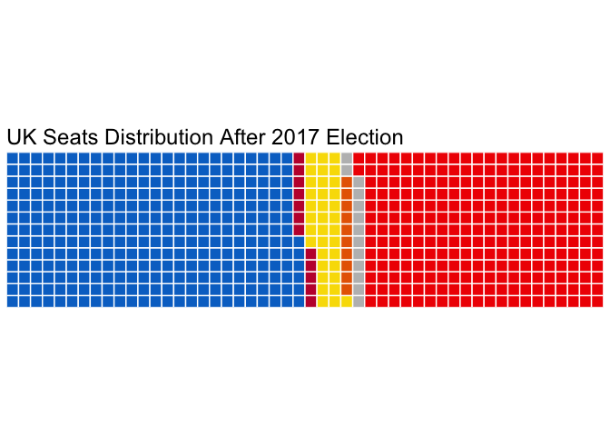
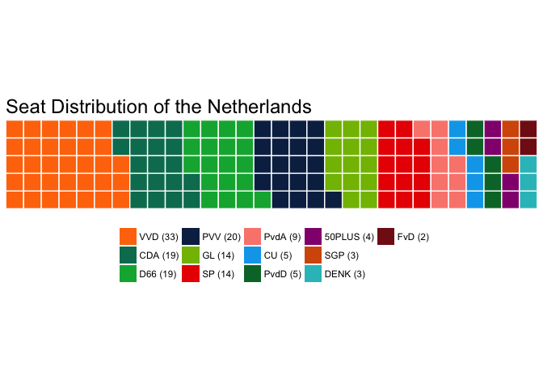

Waffle charts instead of pies and stacked bars?
================

After a long time searching for pie chart alternatives and already experimenting with waffle charts I read an interesting blog post by Ainsley McGrath: [Your Dashboard Needs a Waffle Chart](https://blog.aptitive.com/your-dashboard-needs-a-waffle-chart-64ffaaa6930f). Backed with research I found the content of this article compelling enough experiment with waffle charts or squared pie charts.

More interesting readings on this topic by Robert Kosara on *Eagereyes*:

-   [Engaging Readers with Square Pie/Waffle Charts](https://eagereyes.org/blog/2008/engaging-readers-with-square-pie-waffle-charts)
-   [Women in IT – Squaring the Pie?](https://eagereyes.org/techniques/square-pie-charts) (with discussions from Hadley Wickham).
-   And on why pie charts suck: [Understanding Pie Charts](https://eagereyes.org/pie-charts).

``` r
library(tidyverse)
library(ggthemes)
library(RSvgDevice)
library(waffle)
```

Waffle chart example in R
-------------------------

Example code from a [blog post on rud.is](https://rud.is/b/2015/03/18/making-waffle-charts-in-r-with-the-new-waffle-package/) and package by [Bob Rudis](https://github.com/hrbrmstr/waffle).

-   [Waffle package documentation](https://cran.r-project.org/web/packages/waffle/waffle.pdf)
-   [More waffle code](http://asbcllc.com/blog/2015/march/wu_waffle/index.html)

Remaking of the [famous waffle chart from the New York Times](https://i1.wp.com/graphics8.nytimes.com/images/2008/07/20/business/20debtgraphic.jpg?w=780):

``` r
savings <- c(`Mortgage ($84,911)`=84911, `Auto andntuition loans ($14,414)`=14414, 
             `Home equity loans ($10,062)`=10062, `Credit Cards ($8,565)`=8565)
```

``` r
waffle(savings/392, rows=7, size=0.5, 
       colors=c("#c7d4b6", "#a3aabd", "#a0d0de", "#97b5cf"), 
       title="Average Household Savings Each Year", 
       xlab="1 square == $392")
```



Syrian population variables
---------------------------

The following is why I actually wanted to know more about waffle charts. I wanted to show the share that Syrian war victims have on the total of Syrian population.

``` r
regRefugees <- c( 44, 56)
displSyrians <- c( 89, 11)
casualties <- c( 2, 10, 88)
asylRequests <- c( `Total asylm requests to Europe (938000)` = 1, 
                  `Total population European Union (508000000)` = 508)
```

``` r
multipleWaffles <- iron(
    waffle(regRefugees, 
                  rows = 10, 
                  size = 1, 
                  colors = c("#303F9F", "#BDBDBD"), 
                  title = "89% of Syrians are displaced internally...") +
    theme(legend.position = "none",
          plot.title = element_text(size = 13)),   
    waffle(displSyrians, 
                  rows = 10, 
                  size = 1, 
                  colors = c("#4DD0E1", "#BDBDBD"),
                  title = "17% of Syrians are registered refugees.\n Only 5% applied for asylum in Europe...") +
    theme(legend.position = "none",
          plot.title = element_text(size = 13)),
    waffle(casualties, 
                  rows = 10, 
                  size = 1, 
                  colors = c("#BF3B27", "#FFA726", "#BDBDBD"),
                  title = "465,000 (2%) of Syrians were killed\n and 2,000,000 (10%) were wounded...") +
    theme(legend.position = "none",
          plot.title = element_text(size = 13))
)
```



``` r
waffle(asylRequests, 
                  rows = 10, 
                  size = 0.5, 
                  colors = c("#007B3A", "#BDBDBD"), 
                  title = "Syrian asylum requests compared to EU population between 2011 - 2017") +
theme(plot.title = element_text(size = 14),
      legend.position = "none",
      plot.background = element_rect(fill = "#F4EBDB")) +
xlab("There were 938.000 syrian asylum requests in comparison to 508.000.000 EU citizens") 
```



UK election results
-------------------

``` r
seats <- c(`Tories (318)` = 318,
           `DUP (10)` = 12,
           `SNP (35)` = 35,
           `LD (12)` = 10,
           `Others (13)` = 13,
           `Labour (262)` = 262) 
```

I used this plot for my redesign on the colourful facts blog: [TV is Pre-Eminently the Medium for Unreadable 3D Charts](https://medium.com/tdebeus/tv-is-pre-eminently-the-medium-for-unreadable-3d-charts-9715c18d8edf)

``` r
waffle(seats, rows = 13, size = 0.5,
      colors = c("#0073CC", "#C20F3A", "#F8DD00", "#E76600", "#BDBDBD", "#F01900"),
      title = "UK Seats Distribution After 2017 Election",
      legend_pos="none")
```



It was also the time of Dutch election results
----------------------------------------------

``` r
seatsNL <- c(`VVD (33)` = 33,
            `CDA (19)` = 19,
            `D66 (19)` = 19,
            `PVV (20)` = 20,
            `GL (14)` = 14,
            `SP (14)` = 14,
            `PvdA (9)` = 9, 
            `CU (5)` = 5,
            `PvdD (5)` = 5,
            `50PLUS (4)` = 4,
            `SGP (3)` = 3,
            `DENK (3)` = 3,
            `FvD (2)` = 2)
```

``` r
waffle(seatsNL, rows = 5, size = 0.5,
      colors = c("#FF7609", 
                 "#007B5F", 
                 "#00AF3F", 
                 "#0D2A51", 
                 "#82BC00", 
                 "#E90000", 
                 "#FA877D", 
                 "#00A7EB", 
                 "#007434",
                 "#93117E",
                 "#D65806",
                 "#2DBFC3",
                 "#831717"),
      title = "Seat Distribution of the Netherlands") +
theme(legend.position = "bottom")
```



And why not add the American congress waffle
--------------------------------------------

``` r
seatsUSA <- c(`Democratic (193)` = 193,
             `Republican (239)` = 239,
             `Vacant (3)` = 3)
```

``` r
waffle(seatsUSA, rows = 11, size = 0.5,
      colors = c("#000092", "#920000", "#BDBDBD"),
      title = "Seat Distribution Congress of USA") +
theme(legend.position = "bottom")
```


