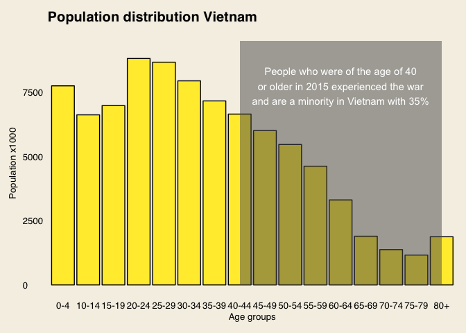

Why the U.S. is so popular in Vietnam even after a devastating war
================

The content of this report shows the code behind two of the three graphics in the article: [Why the U.S. is so popular in Vietnam even after a devastating war]().

-   Population distribution in Vietnam.
-   Estimated deaths Vietnam War.

First things first. We'll import the [Population data](https://esa.un.org/unpd/wpp/Download/Standard/Population/) from the United Nations Population division and load the required packages.

``` r
library(tidyverse)
library(ggthemes)
library(RSvgDevice)

# Load xlsx Viet Nam population tab
df <- read.csv2("/Users/Thomas/Work/Projects/Portfolio/vietnam-and-usa/vietnam-population-UN.csv")
```

Tidying and filtering data
--------------------------

After a Vietnam subset has been exported as a csv file a little cleaning is needed. I learned that R doesn't format column variables if they start with a number. R adds a `X` in front of the numbers. When tidying your data it helps you with the visualising part later on. I can't point out enough how important this is:

> Tidy datasets are easy to manipulate, model and visualize, and have a specific structure: each variable is a column, each observation is a row, and each type of observational unit is a table.

``` r
# Tidy data
vietnam <- df %>%
  gather(key = "Age.group", value = "Est.pop", X0tot4:X80.) %>%
  select(Year:Est.pop) 
# Edit Age.group values
vietnam$Age.group <- gsub("tot", "-", vietnam$Age.group)
vietnam$Age.group <- gsub("X", "", vietnam$Age.group)
vietnam$Age.group <- gsub("80.", "80+", vietnam$Age.group)
# Subset data frame on only year 2015
vietnam2015 <- vietnam %>%
  filter(Year == "2015")

summary(vietnam2015)
```

Plotting the population distribution of Vietnam, 2015
-----------------------------------------------------

``` r
plot1 <- vietnam2015 %>%
  filter(Age.group != "5-9") %>% # Somehow this weird value creeped into the data frame, is therefor filtered out.
  ggplot(aes(x = Age.group, y = Est.pop)) +
  geom_col(colour = "black",
           fill = "#FFEB3B") +
  annotate("rect", xmin = "40-44", xmax = "80+", ymin = 0, ymax = 9500,
           alpha = .5) +
  annotate("text", x = "60-64", y = 7750,
           label = "People who were of the age of 40\nor older in 2015 experienced the war\nand are a minority in Vietnam with 35%",
           colour = "white") +
  labs(x = "Age groups",
       y = "Population x1000",
       title = "Population distribution Vietnam") +
  theme_economist() +
  theme(plot.background = element_rect(fill = "#F5F0E5"),
        panel.background = element_blank(),
        panel.grid = element_blank(),
        axis.line.x = element_blank(),
        axis.ticks.x = element_blank())
  
plot1
```



Vast majority didn't experienced the Vietnam War
------------------------------------------------

Support the claim of Dr Kleinen:

> On top of these political reconciliations, time is a decisive factor. The fact that the generation that experienced the war is a minority in Vietnam helps.

After the following calculations we can conclude that 35% experienced the war (people who were born in the year the war ended were included). 65% didn't experienced the was. The claim has been tested positively.

``` r
# Subset on people who experienced war
expWar <- vietnam2015[c(9:17),]
# Number of people = 32377
sum(expWar$Est.pop)
# Subset on people who didn't experienced the war
notExpWar <- vietnam2015[-c(9:17),]
# Number of people = 61195
sum(notExpWar$Est.pop)
# Total amount of people = 93572 (*1000)
sum(expWar$Est.pop) + sum(notExpWar$Est.pop)
# Percentage of people that didn't experienced the vietnam war is 65%
(61195/93572)*100
```

War casualties during the Vietnam War
-------------------------------------

Retrieved data from thevietnamwar.info - [How Many People Died In The Vietnam War?](https://thevietnamwar.info/how-many-people-died-in-the-vietnam-war/). After careful considerations thi article was considered a reliable source. It referred to:

-   Lewy G., “America in Vietnam”, p.450-453.
-   Rummel R. J., “Vietnam Democide: Estimates, Sources, and Caculations”, Retrieved April 10, 2014 from <http://www.hawaii.edu/powerkills/SOD.TAB6.1A.GIF>.
-   “Statistical Information about Fatal Casualties of the Vietnam War”, Retrieved April 10, 2014 from <http://www.archives.gov/research/military/vietnam-war/casualty-statistics.html> Tucker S. C.,The Encyclopedia of the Vietnam War, Volume I, p.176.
-   “Population and Development Review”, Volume 21, Issue 4, p.790.
-   “Associated Press”, 3 April 1995

For the data frame I took the mean of the lowest estimates and the highest estimates.

``` r
# Tibble of Vietnam War deaths
warCasualties <- tibble(Who = c("N. Vietnam + communist allies",
               "South Vietnam",
               "Vietnamese civilians",
               "United States",
               "Allied forces"),
       Type = c("Military",
                "Military",
                "Civilians",
                "Military",
                "Military"),
       Estimated.deaths = c((950765 + 1100000)/2,
                            (110000 + 313000)/2,
                            2000000,
                            58220,
                            5341))

warCasualties
```

    ## # A tibble: 5 x 3
    ##                             Who      Type Estimated.deaths
    ##                           <chr>     <chr>            <dbl>
    ## 1 N. Vietnam + communist allies  Military          1025382
    ## 2                 South Vietnam  Military           211500
    ## 3          Vietnamese civilians Civilians          2000000
    ## 4                 United States  Military            58220
    ## 5                 Allied forces  Military             5341

Plotting Vietnam war casualties
-------------------------------

The following code has a very basic plot as output. Like always I exported the plot and made it way more attractive in sketch.

``` r
plot2 <- warCasualties %>%
ggplot(aes(x = Estimated.deaths, y = reorder(Who, Estimated.deaths))) +
  geom_segment(aes(x = 0,
                   y = reorder(Who, Estimated.deaths), 
                   xend = Estimated.deaths, 
                   yend = Who)) +
  geom_point(size = 3,
             colour = "#F44336") +
  labs(title = "Vietnam war, killed casualties") +
  theme_fivethirtyeight() +
  theme(plot.background = element_rect(fill = "#F5F0E5"),
        panel.background = element_blank())

plot2
```


